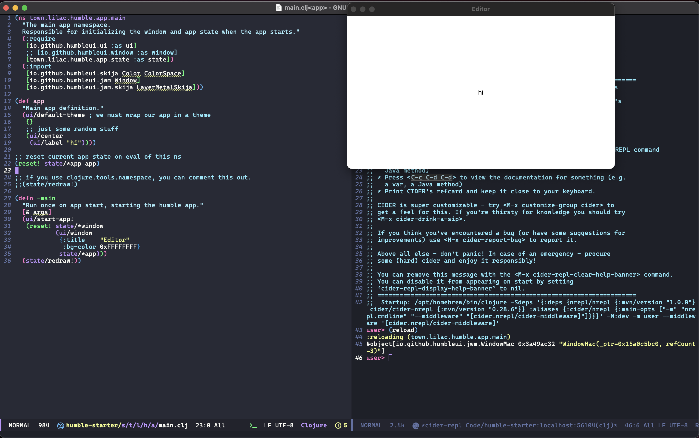

# 7 Humble GUIs

An implementation of [7 GUIs](https://eugenkiss.github.io/7guis/tasks/) in
Clojure + [HumbleUI](https://github.com/HumbleUI/HumbleUI).

Built using [lilactown/humble-starter](https://github.com/lilactown/humble-starter).

## Status

- [x] GUI 1: Counter
- [x] GUI 2: Temperature converter
- [x] GUI 3: Flight booker
- [x] GUI 4: Timer
- [x] GUI 5: CRUD
- [x] GUI 6: Circle drawer
- [ ] GUI 7: Cells

## Running & Devolepment

To start a REPL (including a minimal nREPL server), you can run `./scripts/nrepl.sh`.
For Editor tooling, see below section.

To run each GUI, evaluate the namespace (e.g. `town.lilac.humble.app.gui-1`)
through the REPL. To see changes, evaluate it again.

### CIDER

> TL;DR: Customize the jack in command, delete the `:cider/nrepl` alias at the
> end of the command and replace it with `:dev:cider`

If you use an editor like Emacs or Calva which integrates using CIDER, you can
customize the jack-in command to work with your HumbleUI app.

> NOTE: The default jack-in command will not work, since we need to start the
> HumbleUI app on a different thread than the nREPL server. By default, the
> nREPL server will start and then you would evaluate commands via this
> connection, but this will not work when starting the HumbleUI app.

To ensure that you are loading the correct version of nREPL and CIDER, we start
by running the jack-in command but customizing it. In Emacs, this is
`C-u M-x cider-jack-in`. An example of what the default command looks like:

```
/opt/homebrew/bin/clojure -Sdeps '{:deps {nrepl/nrepl {:mvn/version "1.0.0"} cider/cider-nrepl {:mvn/version "0.28.6"}} :aliases {:cider/nrepl {:main-opts ["-m" "nrepl.cmdline" "--middleware" "[cider.nrepl/cider-middleware]"]}}}' -M:cider/nrepl
```

For our purposes, the `user` ns has a `-main` function which handles all of the
app and nREPL server initialization. The only thing we need to replace the call to
CIDER's main wiht our own and pass in the middlewares to it.

Below, we show the command after we delete the use of the `:cider/nrepl` alias
and replace it with the `:dev:cider` alias configured in our deps.edn, which
calls our custom `-main` function wiht the CIDER middlewares

```
/opt/homebrew/bin/clojure -Sdeps '{:deps {nrepl/nrepl {:mvn/version "1.0.0"} cider/cider-nrepl {:mvn/version "0.28.6"}} :aliases {:cider/nrepl {:main-opts ["-m" "nrepl.cmdline" "--middleware" "[cider.nrepl/cider-middleware]"]}}}' -M:dev:cider
```



## Credit

A lot of this code was copied and then modified from the HumbleUI codebase
itself, as well as [humble-dec](https://github.com/tonsky/humble-deck/) and
[humble-animations](https://github.com/oakmac/humble-animations). Thanks to
@tonsky for developing HumbleUI and releasing so many cool examples, and @oakmac
for showing me some cool stuff too!

## License & Copyright

Licensed under MIT. Copyright Will Acton 2022.
